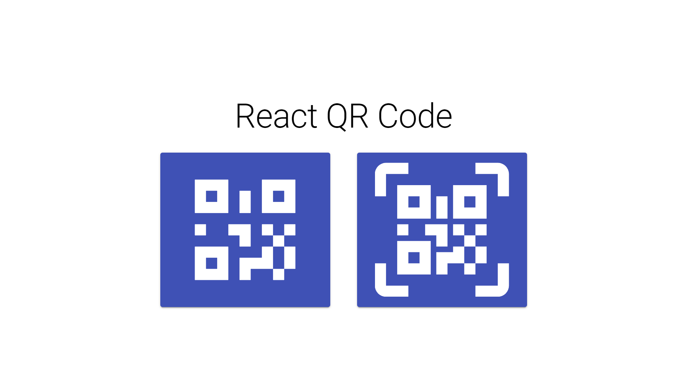
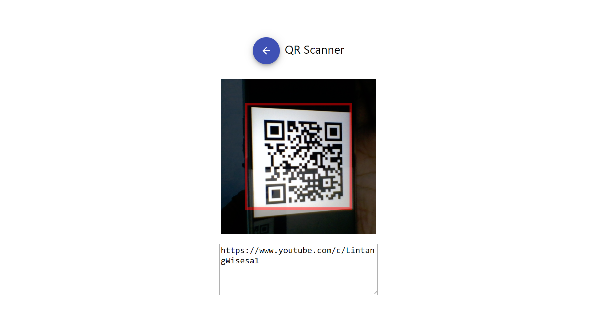

# React QR Code Product Scanner and Code Verification

A simple React application to scan Quick Response code (QR code)  and input. 

- __Clone this repo__:

  ```bash
  $ git clone https://github.com/LintangWisesa/React-verification-system.git
  $ npm i
  $ npm start
  ```

- __React UI Kit: [Material UI](https://material-ui.com/)__

    Install Material UI core:
    ```bash
    $ npm i @material-ui/core @material-ui/icons
    ```

- __Icons: [Material Design Icons](https://materialdesignicons.com/)__

    Install Material Design Icons:
    ```bash
    $ npm i @mdi/react @mdi/js @mdi/font
    ```

    Add these lines on `./public/index.html` head:
    ```html
    <!-- Roboto fonts -->
    <link rel="stylesheet" href="https://fonts.googleapis.com/css?family=Roboto:300,400,500,700&display=swap" />
    <!-- Material Icons fonts -->
    <link rel="stylesheet" href="https://fonts.googleapis.com/icon?family=Material+Icons" />
    ```

- __QR Scanner: [react-qr-reader](https://www.npmjs.com/package/react-qr-reader)__

    Install `react-qr-reader`:
    ```bash
    $ npm i react-qr-reader
    ```

- __Preview__

  Home Page

  

  QR Scanner Page
  
  

<hr>

